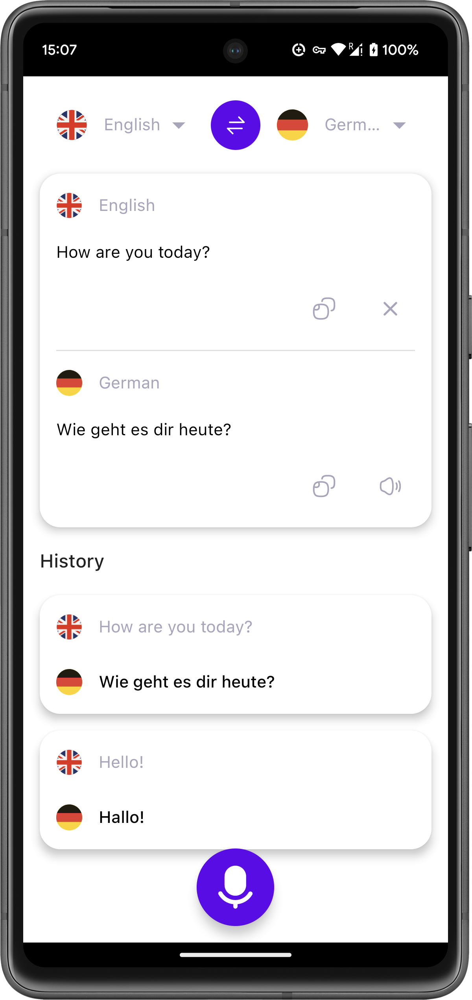
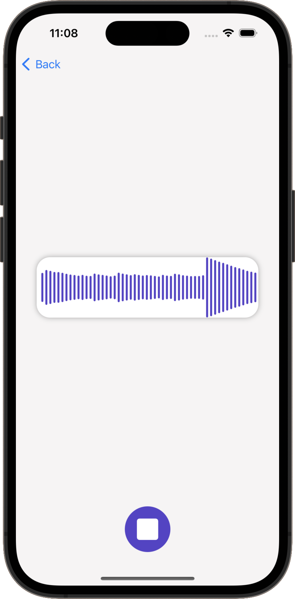

# Translator-KMM

Translator app implemented with KMM (Kotlin Multiplatform Mobile).

This app is result of KMM course provided by [Philipp Lackner](https://github.com/philipplackner).
The aim of this course was to use KMM to develop a real-life app which can be run on both Android
and iOS with use of Kotlin and Swift. Except of KMM this project also uses these technologies:
Jetpack Compose, SwiftUI, Coil, Hilt, Ktor, SqlDelight, Turbine and speech recognition.

|                          Android                          |                          iOS                          |
|:---------------------------------------------------------:|:-----------------------------------------------------:|
|      |      |
|  |  |
